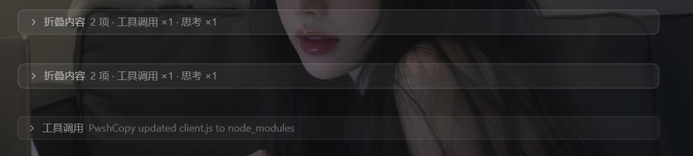
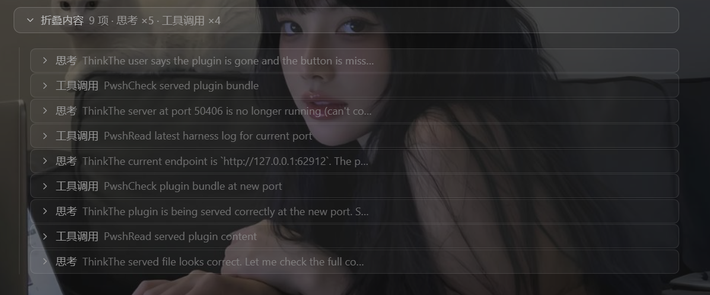

# dsh-fold-context

Auto-fold context/system messages in DSH conversation — collapse think blocks, tool calls, and tool results into grouped expandable bars.

自动折叠 DSH 对话中的系统 / 上下文消息——把思考块（think）、工具调用和工具结果合并成可展开的分组折叠条，让长对话回归清爽。

## Features / 功能特性

- **Auto-detect & fold / 自动识别并折叠**：Think blocks, tool calls, tool results, and context injection messages are automatically collapsed. / 自动折叠思考块、工具调用、工具结果和上下文注入消息。
- **Multi-level grouping / 多级分组**：Adjacent foldable blocks (think + tool-call + tool-result) merge into a single group bar with sub-bars. / 相邻的可折叠块（思考 + 工具调用 + 工具结果）合并为一条分组条，内含子折叠条。
- **Streaming-safe / 流式输出安全**：Debounced DOM scanning catches elements as they arrive during streaming. / 带防抖的 DOM 扫描，能在流式输出过程中捕捉新出现的元素。
- **Transparent styling / 无侵入样式**：Minimal, neutral UI that blends with the conversation. / 极简中性的界面，融入对话不突兀。
- **Click to expand / 点击展开**：Each fold bar is clickable to reveal the hidden content. / 每条折叠条都可点击展开，查看被隐藏的内容。

## Screenshots / 效果截图

折叠状态 / Folded:



展开状态 / Expanded:



## Install / 安装

```bash
# 安装最新版本 / Install latest
dsh plugin add github:cayan0x/dsh-fold-context

# 安装指定版本 / Install specific version
dsh plugin add github:cayan0x/dsh-fold-context#v0.1.3
```

Or manually: copy the plugin into your DSH profile's `packages/` directory. / 或手动：将插件复制到 DSH 配置的 `packages/` 目录。

## Versions / 版本管理

All releases are tagged on GitHub. To install a specific version, use `#v<version>` after the repo URL. See [GitHub Releases](https://github.com/cayan0x/dsh-fold-context/releases) for the full version history. / 所有版本在 GitHub 上以 tag 标记。安装特定版本时在仓库地址后加 `#v<version>`。完整版本历史见 [GitHub Releases](https://github.com/cayan0x/dsh-fold-context/releases)。

## License / 许可

MIT
